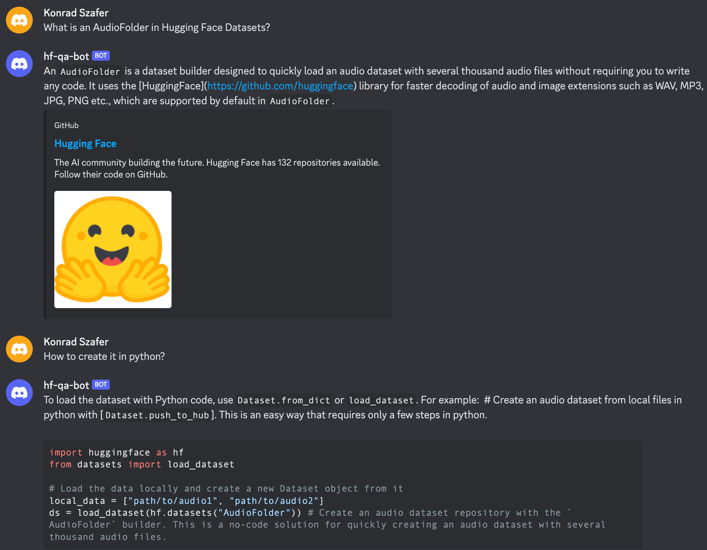

# Hugging Face Question Answering Bot

This repository focuses on the development of a Hugging Face question answering bot that assists users in creating their own ML solutions and troubleshooting technical issues related to Hugging Face libraries. Our solution combines an efficient context retrieval mechanism powered by FAISS with Stanford's Alpaca 7B language model to provide accurate and contextually relevant guidance derived from the Hugging Face documentation. The bot is designed to operate entirely locally on a consumer device, ensuring both accessibility and privacy. 

# Purpose
The Hugging Face Question Answering Bot is designed to help users quickly find solutions to common problems and questions related to Hugging Face libraries. Whether you're just getting started with ML or you're an experienced developer looking for advanced guidance, the bot can help you get the information you need to succeed.

# Example


# Table of Contents
- [Setting up the bot](#setting-up-the-bot)
    - [Running in a Docker](#running-in-a-docker)
    - [Running in a Python](#running-in-a-python)
- [Development instructions](#development-instructions)
- [Datasets](#dataset-list)

## Setting up the bot
First, you need to provide the necessary environmental variables and API keys in the .env file. 
- `HUGGINGFACEHUB_API_TOKEN` - API key for HF Hub
- `DISCORD_TOKEN` - API key for the bot application
- `QUESTION_ANSWERING_MODEL_ID` - an ID of a model to be queried from HF Hub (in case of inference through API)
- `EMBEDDING_MODEL_ID` - an ID of embedding model, used to create and query index on the documents
- `INDEX_NAME` - directory where the index files are present after creation
- `USE_DOCS_IN_CONTEXT` - allow context extration from documents
- `ADD_SOURCES_TO_RESPONSE` - show references to documents that were used as a context for a given query
- `USE_MESSEGES_IN_CONTEXT` - allow to use chat history for conversational experience
- `NUM_LAST_MESSAGES` - number of messages used for the previous feature
- `USE_NAMES_IN_CONTEXT` - use names of users in context
- `ENABLE_COMMANDS` - allow command, e.g. channel cleanup
- `RUN_LOCALY` - run inference locally
- `DEBUG` - provides additional logging

If you decide that you want to **run everthing locally** our current MVP recommends using Instructor large and Alpaca 7B with 4-bit quatization models. For this to properly work, you need to put the weights of the model in the `/bot/question_answering/` and set the `QUESTION_ANSWERING_MODEL_ID` variable to the name of the file that you just put in the aforementioned folder. Now, you should be able to run your own, local instance of the bot.

### Running in a Docker
```bash
docker build -t <container-name> .
docker run <container-name>
# or simply:
./run_docker.sh
```

### Running in a Python
```bash
pip install -r requirements.txt
python3 -m bot
```

## Development Instructions

To install all necessary Python packages, run the following command:

```bash
pip install -r requirements.txt
```
We use the pipreqsnb to generate the requirements.txt file. To install pipreqsnb, run the following command:

```bash
pip install pipreqsnb
```
To generate the requirements.txt file, run the following command:

```bash
pipreqsnb --force .
```

To run unit tests, you can use the following command:

```bash
pytest -o "testpaths=tests" --noconftest
``` 

## Dataset List

Below is a list of the datasets used during development:
- [Stack Overflow - Python](https://huggingface.co/datasets/KonradSzafer/stackoverflow_python_preprocessed)
- [Stack Overflow - Linux](https://huggingface.co/datasets/KonradSzafer/stackoverflow_linux)
- [Hugging Face Documentation](https://huggingface.co/docs)
